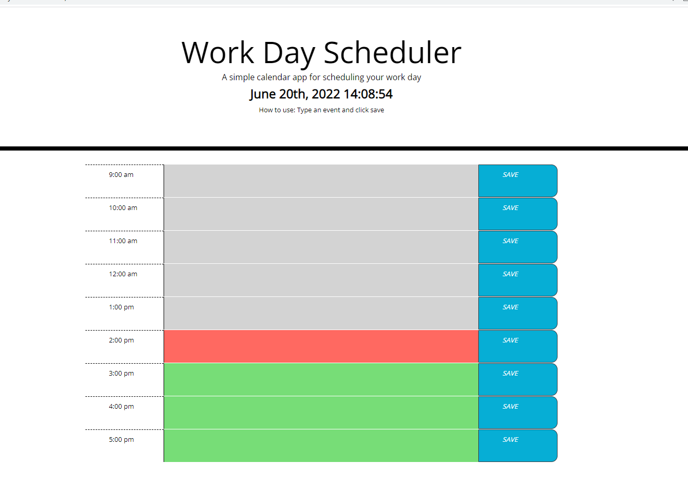

# Daily Calendar Demo

With this Daily Calendar tool, Users are able to record events to plan out their work day. This application has the functionality to save events and will still persist even after closing it. It also has distinct colors to show when a time block is either in the past, present, or future. Lastly, it displays real time and date. This application demonstrates usage of third-party APIs such as moment.js and Bootstrap. 

# User Story

AS AN employee with a busy schedule,
I WANT to add important events to a daily planner
SO THAT I can manage my time effectively.

# Acceptance Criteria

**GIVEN** I am using a daily planner to create a schedule.

**WHEN** I open the planner
**THEN** the current day is displayed at the top of the calendar.

**WHEN** I scroll down
**THEN** I am presented with time blocks for standard business hours.

**WHEN** I view the time blocks for that day
**THEN** each time block is color-coded to indicate whether it is in the past, present, or future.

**WHEN** I click into a time block
**THEN** I can enter an event.

**WHEN** I click the save button for that time block
**THEN** the text for that event is saved in local storage.

**WHEN** I refresh the page
**THEN** the saved events persist.

# Screenshot

# Details

This application displays the following skills:

- Using Bootstrap to define the layout.
- Displays current date and time using moment.js
- Application functions with JQuery

This is a challenge assignment for UCR bootcamp. Since it was an odd week in the program, a starter code was provided by the UCR bootcamp. 

# links

GitHub repository:  [https://github.com/DKhubgit/Daily-Calendar-Demo](https://github.com/DKhubgit/Daily-Calendar-Demo)

GitHub Pages:  [https://dkhubgit.github.io/Daily-Calendar-Demo/](https://dkhubgit.github.io/Daily-Calendar-Demo/)